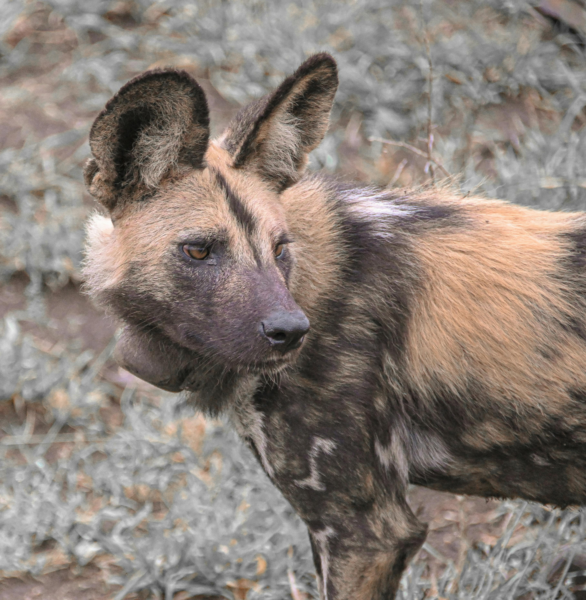

# Landing Page
 A simple landing page made with HTML and CSS, made by replicating a design provided by the Odin Project.
<h2>Features</h2>
<ul>
    <li>Navigation bar with header links and place for a logo
    <li>Hero section with big text and subtext underneath, sign up buttons and a placeholder where an image can go
    <li>Images with descriptions underneath
    <li>A quote section
    <li>A call to action box 
    <li>Footer
</ul>

<h2>Technologies</h2>
<ul>
    <li>HTML5
    <li>CSS3
</ul>
<h2>Images Used</h2>
<ul>
    <li>Hyena on a Desert, Photo by Corné Nel on Pexels   
    <li>Charming Calico Cat in a Natural Backyard Setting, Photo by Roman Biernacki on Pexels   
    <li>Animal Portrait of a Gorilla, Photo by Pierre LESCOT on Pexels   
    <li>Adult Tiger, Photo by Pixabay on Pexels   
</ul>
